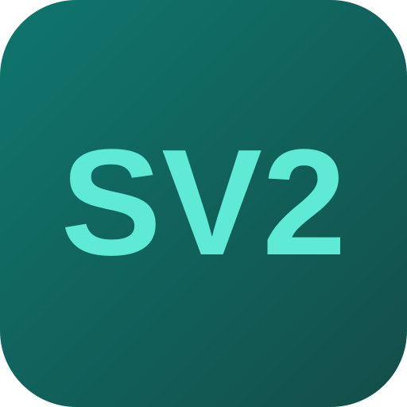

<p align="center">
  
</p>

# Stratum V2 UI on StartOS

> **Upstream repo:** <https://github.com/stratum-mining/sv2-ui>

Stratum V2 UI is a setup wizard and monitoring dashboard for running a [Stratum V2](https://stratumprotocol.org/) mining stack. It drives a **nested Docker engine** that launches the Stratum V2 Translator Proxy, letting legacy SV1 miners (Bitaxe, Antminer, etc.) connect to Stratum V2 pools, and surfaces pool status, hashrate, workers, and submitted shares in one dashboard.

---

## Table of Contents

- [Architecture](#architecture)
- [Image and Container Runtime](#image-and-container-runtime)
- [Volume and Data Layout](#volume-and-data-layout)
- [Installation and First-Run Flow](#installation-and-first-run-flow)
- [Network Access and Interfaces](#network-access-and-interfaces)
- [Health Checks](#health-checks)
- [Dependencies](#dependencies)
- [Limitations and Differences](#limitations-and-differences)
- [Build Requirements](#build-requirements)
- [Quick Reference for AI Consumers](#quick-reference-for-ai-consumers)

---

## Architecture

Upstream `sv2-ui` is not a self-contained service — it is a **Docker control-plane**. Its Express/Dockerode backend talks to a Docker socket to pull and spawn the real mining containers (`stratumv2/translator_sv2`, and optionally `stratumv2/jd_client_sv2`) based on the user's setup choices, then its dashboard reads those containers' monitoring APIs. Umbrel runs it inside a privileged Docker-in-Docker container.

StartOS has no host Docker socket, so this package mirrors the same design using the StartOS [nested OCI runtime](https://docs.start9.com/packaging) capability: the service's own subcontainer runs a real `dockerd`, and `sv2-ui` drives it exactly as it would on any other host.

- A single subcontainer image bakes in **both** the Docker engine (`docker-ce` + `containerd` + a `runc` wrapper) and the `sv2-ui` Node app built from source.
- The daemon entrypoint (`docker/start.sh`) starts `dockerd` in the background, waits for it to be ready, then `exec`s the `sv2-ui` server.
- `sv2-ui` connects to `dockerd` over the default `/var/run/docker.sock`. The Translator/JDC containers it spawns publish their ports onto the subcontainer's loopback; `127.0.0.1 sv2-translator sv2-jdc` is added to `/etc/hosts` so the in-app monitoring proxy resolves them.
- The Translator's miner port (`34255`) is published into the subcontainer's network namespace and exposed by StartOS as the **Stratum** interface.

`dockerd` runs rootful with the `fuse-overlayfs` storage driver and a `runc-nested` wrapper that strips the `net.ipv4.ip_unprivileged_port_start` sysctl runc can't apply across the nested-userns boundary. This requires the `userspaceFilesystems` (`/dev/fuse`) and `virtualNetworking` (`/dev/net/tun`) manifest grants.

---

## Image and Container Runtime

| Property      | Value                                                            |
| ------------- | ---------------------------------------------------------------- |
| Image         | Built from `Dockerfile` (node:24-bookworm-slim + docker-ce + sv2-ui) |
| sv2-ui source | `stratum-mining/sv2-ui` @ `v0.4.0` (cloned and built at image build) |
| Architectures | x86_64, aarch64                                                  |
| Entrypoint    | `tini -- /usr/local/bin/start.sh` (runs `dockerd`, then sv2-ui)  |

---

## Volume and Data Layout

| Volume | Mount Point    | Purpose                                                        |
| ------ | -------------- | ------------------------------------------------------------- |
| `main` | `/data`        | Persistent data root                                          |
|        | `/data/config` | TOML configs sv2-ui generates for the Translator/JDC          |
|        | `/data/docker` | Nested Docker `data-root` (images + container state)          |

---

## Installation and First-Run Flow

1. Install and start. The dashboard becomes available once `dockerd` is up and the sv2-ui server is listening on `8080`.
2. Open the Web UI and complete the setup wizard (choose a pool, configure the Translator). On completion sv2-ui **pulls the Translator image from Docker Hub** (internet required) and starts it inside the nested engine.
3. Point SV1 miners at the **Stratum** interface address shown under this service's Interfaces tab.

---

## Network Access and Interfaces

| Interface | Port  | Protocol   | Purpose                                                  |
| --------- | ----- | ---------- | -------------------------------------------------------- |
| Web UI    | 8080  | HTTP       | Setup wizard + monitoring dashboard                      |
| Stratum   | 34255 | TCP (raw)  | SV1 miners connect here (`stratum+tcp://…:34255`)        |

The Translator's monitoring port (9092) and any JD Client ports stay internal to the subcontainer and are not exposed.

---

## Health Checks

| Check         | Method                | Messages                                                        |
| ------------- | --------------------- | --------------------------------------------------------------- |
| Web Interface | Port listening (8080) | "The web interface is ready" / "The web interface is not ready" |

The Stratum interface only has a listener after setup completes; it is intentionally not health-checked.

---

## Dependencies

None enforced. Pool/SV1-translation mode is fully standalone. **Job Declaration (sovereign) mode** additionally needs a Bitcoin Core node reachable over its IPC socket; cross-package IPC mounting is not wired in this package yet, so JD mode is not yet supported on StartOS.

---

## Limitations and Differences

1. **Nested Docker is required.** This package only functions on StartOS builds that provide the `userspaceFilesystems` and `virtualNetworking` manifest grants (StartOS 0.4.0-beta.10 / start-sdk 2.0.0+). See [Build Requirements](#build-requirements).
2. **Runtime image pull.** The Translator (and JDC) images are pulled from Docker Hub on first setup rather than baked into the s9pk, mirroring upstream/Umbrel. The server needs internet access for that first pull; pulled images persist on the `main` volume.
3. **Job Declaration mode unsupported (yet)** — see [Dependencies](#dependencies).

---

## Build Requirements

The nested-OCI manifest flags (`userspaceFilesystems`, `virtualNetworking`) are part of **start-sdk 2.0.0** (StartOS 0.4.0-beta.10), which at the time of writing is not yet published to npm. Until the SDK publishes, this package pins start-sdk `1.5.3` and the two flags are **commented out in `startos/manifest/index.ts`** — the image builds, but the nested engine has no `/dev/fuse` / `/dev/net/tun` and cannot launch containers. To ship a functional release: bump start-sdk to 2.0.0, uncomment the flags, and adapt to the 2.0 API (lazy `SubContainer.of`, record-then-materialize `Daemons`).

---

## Quick Reference for AI Consumers

```yaml
package_id: sv2-ui
image: built from Dockerfile (docker-ce + sv2-ui v0.4.0)
architectures: [x86_64, aarch64]
volumes:
  main: /data            # /data/config (TOML), /data/docker (nested docker data-root)
ports:
  ui: 8080               # HTTP dashboard
  stratum: 34255         # raw TCP, SV1 miner connections (Translator Proxy)
nested_runtime: dockerd (rootful, fuse-overlayfs, runc-nested wrapper)
requires_manifest_flags: [userspaceFilesystems, virtualNetworking]  # start-sdk 2.0.0+
dependencies: none (JD mode would need Bitcoin Core IPC; not yet wired)
startos_managed_env_vars:
  HOST_OS: startos
  STRATUM_HOST: <stratum interface hostname>   # shown to miners in the UI
actions: none
```
